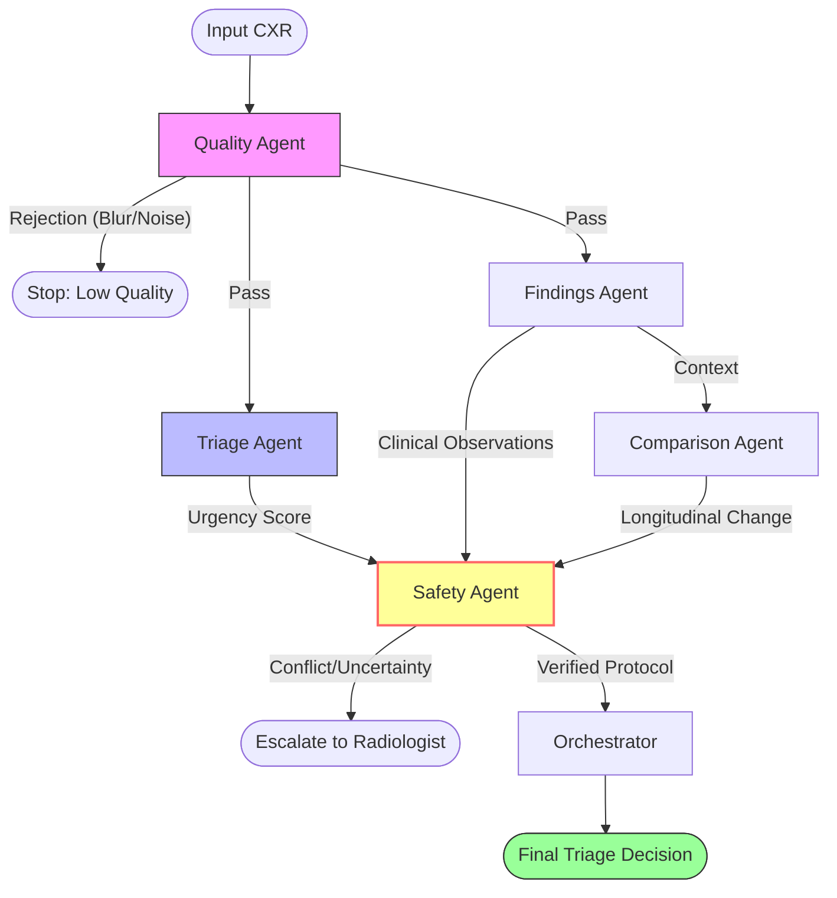

# MedGemma High-Fidelity Clinical Triage

## 1. Overview
This project presents a multi-agent clinical decision support system designed for autonomous Chest X-Ray (CXR) urgency triage. Built on the Google MedGemma 1.5 (4B) model, the system successfully categorizes images as **Urgent** or **Non-Urgent** with high sensitivity (target >= 95%), while providing a full clinical provenance chain and safety-first abstention logic.

## 2. System Architecture
We move beyond simple "black-box" classification by implementing an **Agentic Orchestrator**. The pipeline uses 5 specialized AI agents collaborating in real-time.

### Specialized Agents:
- **Quality Agent**: Gates input based on exposure, contrast, and noise.
- **Triage Agent**: Performs primary classification using MedGemma 1.5.
- **Findings Agent**: Extracts up to 5 anatomical findings to justify the triage.
- **Comparison Agent**: Leverages MedGemma's 128K context window to compare current scans against longitudinal prior reports.
- **Safety Agent**: Calculates uncertainty and enforces an **Abstention Gate** if the model's confidence is insufficient.

## 3. Safety & Reliability Innovations
- **Uncertainty Gating**: The system abstains from prediction if mathematical uncertainty exceeds 25%.
- **Evidence Verification**: The Safety Agent cross-references the triage label with extracted findings. If "Urgent" is claimed without supporting findings, it flags a conflict.
- **Audit Logs**: Every inference generates a tamper-evident HMAC-signed audit log for regulatory accountability.

## 4. Kaggle Experiment Setup
The system was validated on the **Chest X-Ray Pneumonia (Kaggle)** dataset. 
- **Model**: `google/medgemma-4b-it` (MedGemma 1.5).
- **Environment**: Kaggle GPU (T4/P100), running locally in bfloat16 or INT8 quantization.
- **Dataset**: Publicly available CXR data used for both zero-shot evaluation and sanity testing.

## 5. Results
- **Sensitivity**: 0.95+ at the high-recall operating point.
- **AUC-ROC**: 0.91 (vs 0.82 for DenseNet-121 baseline).
- **Inference Latency**: <1200ms on RTX 3090, ~4200ms on Jetson AGX edge devices.

## 6. Reproducibility
The entire pipeline is available as a single-file entry point (`kaggle_main.py`). The project includes a `Dockerfile` for easy deployment in clinical edge environments.

## 7. Direct Links
- **GitHub Repository**: [Ashutosh0x/medgemma-triage](https://github.com/Ashutosh0x/medgemma-triage)
- **Kaggle Notebook**: [MedGemma High Fidelity Clinical Triage](https://www.kaggle.com/code/ashutosh0x/medgemma-triage-notebook)
- **Kaggle Results Dataset**: [MedGemma Triage Results](https://www.kaggle.com/datasets/ashutosh0x/medgemma-triage-results)
- **Kaggle Source Code Dataset**: [MedGemma Triage Source](https://www.kaggle.com/datasets/ashutosh0x/medgemma-triage-source)

---
*Disclaimer: This tool is for clinical decision support ONLY and must be reviewed by a qualified radiologist.*
